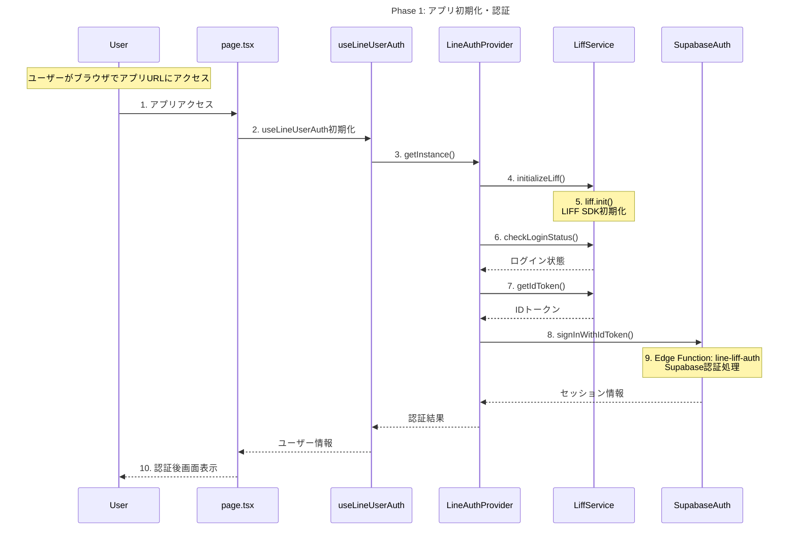

```mermaid
sequenceDiagram
    participant U as User
    participant P as page.tsx
    participant ULA as useLineUserAuth
    participant LAP as LineAuthProvider
    participant LS as LiffService
    participant SA as SupabaseAuth

    title Phase 1: アプリ初期化・認証

    Note over U: ユーザーがブラウザでアプリURLにアクセス
    
    U->>P: 1. アプリアクセス
    P->>ULA: 2. useLineUserAuth初期化
    ULA->>LAP: 3. getInstance()
    LAP->>LS: 4. initializeLiff()
    
    Note over LS: 5. liff.init()<br/>LIFF SDK初期化
    
    LAP->>LS: 6. checkLoginStatus()
    LS-->>LAP: ログイン状態
    
    LAP->>LS: 7. getIdToken()
    LS-->>LAP: IDトークン
    
    LAP->>SA: 8. signInWithIdToken()
    
    Note over SA: 9. Edge Function: line-liff-auth<br/>Supabase認証処理
    
    SA-->>LAP: セッション情報
    LAP-->>ULA: 認証結果
    ULA-->>P: ユーザー情報
    P-->>U: 10. 認証後画面表示
```