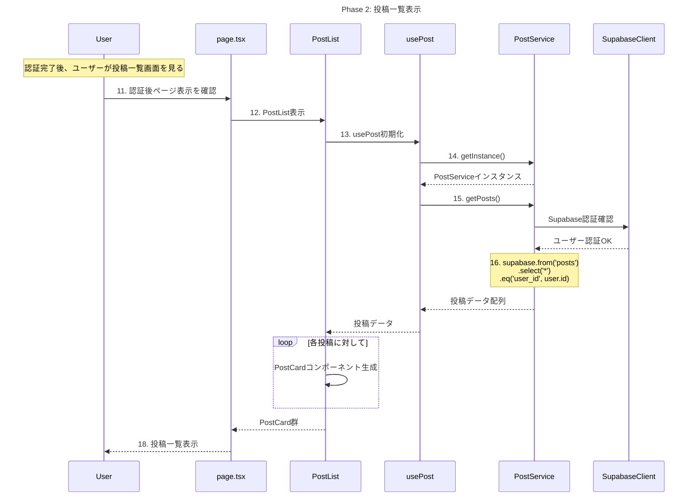

```mermaid
sequenceDiagram
    participant U as User
    participant P as page.tsx
    participant PL as PostList
    participant UP as usePost
    participant PS as PostService
    participant SC as SupabaseClient

    title Phase 2: 投稿一覧表示

    Note over U: 認証完了後、ユーザーが投稿一覧画面を見る
    
    U->>P: 11. 認証後ページ表示を確認
    P->>PL: 12. PostList表示
    PL->>UP: 13. usePost初期化
    UP->>PS: 14. getInstance()
    PS-->>UP: PostServiceインスタンス
    
    UP->>PS: 15. getPosts()
    PS->>SC: Supabase認証確認
    SC-->>PS: ユーザー認証OK
    
    Note over PS: 16. supabase.from('posts')<br/>.select('*')<br/>.eq('user_id', user.id)
    
    PS-->>UP: 投稿データ配列
    UP-->>PL: 投稿データ
    
    loop 各投稿に対して
        PL->>PL: PostCardコンポーネント生成
    end
    
    PL-->>P: PostCard群
    P-->>U: 18. 投稿一覧表示
```