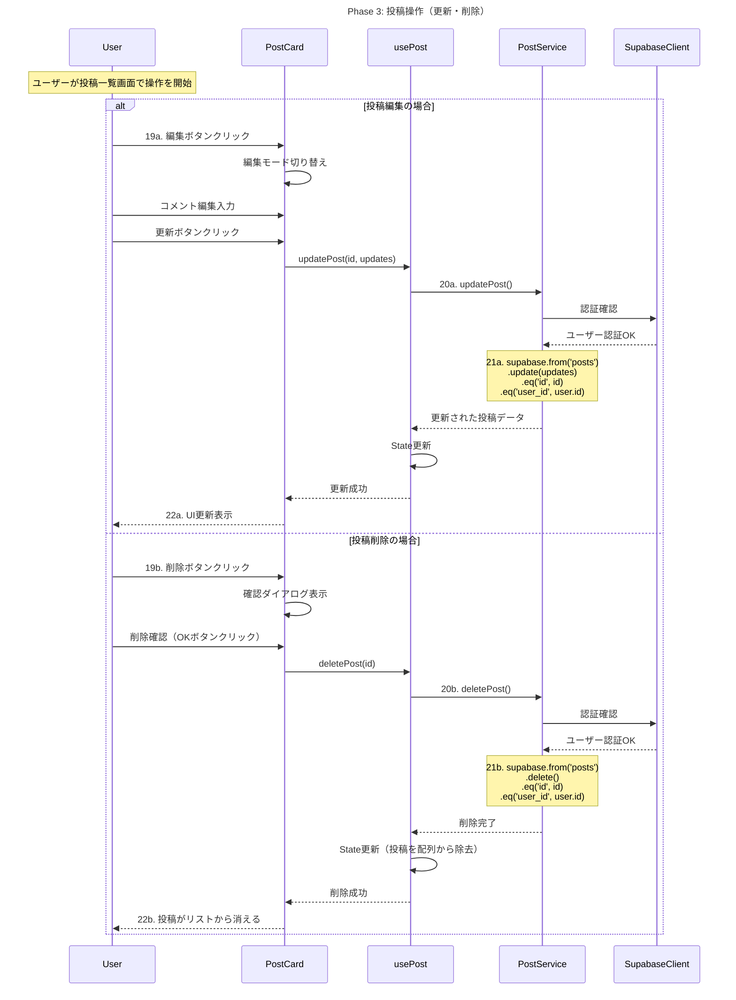

```mermaid
sequenceDiagram
    participant U as User
    participant PC as PostCard
    participant UP as usePost
    participant PS as PostService
    participant SC as SupabaseClient

    title Phase 3: 投稿操作（更新・削除）

    Note over U: ユーザーが投稿一覧画面で操作を開始

    alt 投稿編集の場合
        U->>PC: 19a. 編集ボタンクリック
        PC->>PC: 編集モード切り替え
        U->>PC: コメント編集入力
        U->>PC: 更新ボタンクリック
        PC->>UP: updatePost(id, updates)
        UP->>PS: 20a. updatePost()
        PS->>SC: 認証確認
        SC-->>PS: ユーザー認証OK
        
        Note over PS: 21a. supabase.from('posts')<br/>.update(updates)<br/>.eq('id', id)<br/>.eq('user_id', user.id)
        
        PS-->>UP: 更新された投稿データ
        UP->>UP: State更新
        UP-->>PC: 更新成功
        PC-->>U: 22a. UI更新表示
        
    else 投稿削除の場合
        U->>PC: 19b. 削除ボタンクリック
        PC->>PC: 確認ダイアログ表示
        U->>PC: 削除確認（OKボタンクリック）
        PC->>UP: deletePost(id)
        UP->>PS: 20b. deletePost()
        PS->>SC: 認証確認
        SC-->>PS: ユーザー認証OK
        
        Note over PS: 21b. supabase.from('posts')<br/>.delete()<br/>.eq('id', id)<br/>.eq('user_id', user.id)
        
        PS-->>UP: 削除完了
        UP->>UP: State更新（投稿を配列から除去）
        UP-->>PC: 削除成功
        PC-->>U: 22b. 投稿がリストから消える
    end
```