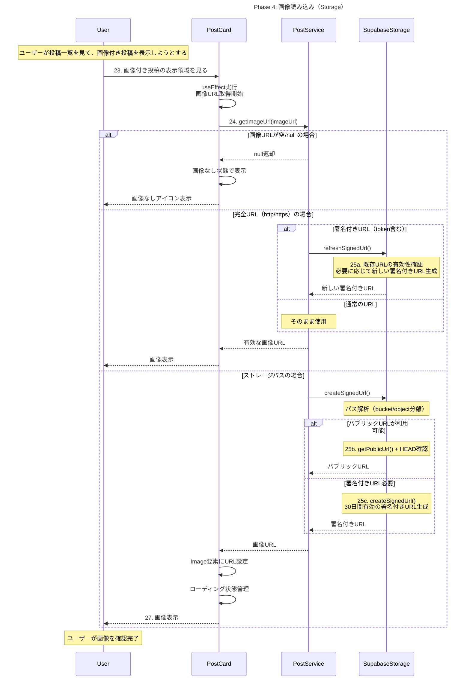

```mermaid
sequenceDiagram
    participant U as User
    participant PC as PostCard
    participant PS as PostService
    participant SS as SupabaseStorage

    title Phase 4: 画像読み込み（Storage）

    Note over U: ユーザーが投稿一覧を見て、画像付き投稿を表示しようとする
    
    U->>PC: 23. 画像付き投稿の表示領域を見る
    PC->>PC: useEffect実行<br/>画像URL取得開始
    PC->>PS: 24. getImageUrl(imageUrl)
    
    alt 画像URLが空/null の場合
        PS-->>PC: null返却
        PC->>PC: 画像なし状態で表示
        PC-->>U: 画像なしアイコン表示
        
    else 完全URL（http/https）の場合
        alt 署名付きURL（token含む）
            PS->>SS: refreshSignedUrl()
            Note over SS: 25a. 既存URLの有効性確認<br/>必要に応じて新しい署名付きURL生成
            SS-->>PS: 新しい署名付きURL
        else 通常のURL
            Note over PS: そのまま使用
        end
        PS-->>PC: 有効な画像URL
        PC-->>U: 画像表示
        
    else ストレージパスの場合
        PS->>SS: createSignedUrl()
        Note over SS: パス解析（bucket/object分離）
        
        alt パブリックURLが利用可能
            Note over SS: 25b. getPublicUrl() + HEAD確認
            SS-->>PS: パブリックURL
        else 署名付きURL必要
            Note over SS: 25c. createSignedUrl()<br/>30日間有効の署名付きURL生成
            SS-->>PS: 署名付きURL
        end
        PS-->>PC: 画像URL
        PC->>PC: Image要素にURL設定
        PC->>PC: ローディング状態管理
        PC-->>U: 27. 画像表示
    end
    
    Note over U: ユーザーが画像を確認完了
```