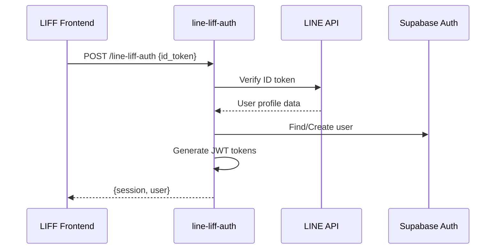

# LINE LIFF認証Edge Function

LINE LIFF IDトークンの検証を処理し、Supabase認証セッションを作成するSupabase Edge Function。

## 🏗️ アーキテクチャ概要

このEdge FunctionはLINE認証とSupabase Authを橋渡しします：

- **ハンズオン2-4**: LIFF IDトークン検証とSupabaseセッション作成
- **ハンズオン3-3**: ユーザー管理とデータベース統合

## 🔄 認証フロー



## 📁 関数構造

```
line-liff-auth/
├── index.ts           # メイン関数実装
├── README.md          # 関数ドキュメント
└── CLAUDECODE.md      # このファイル
```

## 🔧 主要コンポーネント

### 1. 環境変数検証

```typescript
interface Environment {
  LINE_CHANNEL_ID: string;
  EDGE_FUNCTION_JWT: string;
  SUPABASE_URL: string;
  SUPABASE_SERVICE_ROLE_KEY: string;
}
```

**必要変数:**
- `LINE_CHANNEL_ID`: トークン検証用LINEチャンネルID
- `EDGE_FUNCTION_JWT`: Supabase JWTトークン署名用秘密鍵
- `SUPABASE_URL`: SupabaseプロジェクトURL
- `SUPABASE_SERVICE_ROLE_KEY`: ユーザー管理用管理者キー

### 2. LINE IDトークン検証

**エンドポイント:** `https://api.line.me/oauth2/v2.1/verify`

**プロセス:**
1. フロントエンドからLIFF IDトークンを受信
2. LINE OAuth2 APIでトークンを検証
3. ユーザープロフィール情報を抽出
4. トークン署名と有効期限を検証

**レスポンスフォーマット:**
```typescript
interface LineProfile {
  sub: string;        // LINEユーザーID
  name: string;       // 表示名
  picture: string;    // プロフィール画像URL
  email?: string;     // メール（利用可能な場合）
}
```

### 3. ユーザー管理

**UserManagerクラス:**
- `findUserByLineId()`: LINE IDで既存ユーザーを検索
- `createUser()`: LINEプロフィールで新しいSupabaseユーザーを作成
- `updateUser()`: 既存ユーザーを最新のLINEデータで更新

**ユーザーメタデータ構造:**
```typescript
{
  liff_user_id: string;      // LINEユーザーID
  liff_display_name: string; // LINE表示名
  liff_picture_url: string;  // プロフィール画像URL
  provider: 'line';          // 認証プロバイダー
}
```

### 4. JWTトークン生成

**トークンタイプ:**
- **アクセストークン**: 24時間有効、ユーザークレームを含む
- **リフレッシュトークン**: 30日有効、セッション更新用

**クレーム構造:**
```typescript
{
  sub: string;           // ユーザーUUID
  aud: 'authenticated';  // オーディエンス
  role: 'authenticated'; // ユーザーロール
  email: string;         // ユーザーメール
  user_metadata: object; // LINEプロフィールデータ
}
```

## 🔒 セキュリティ機能

### 1. CORS設定

```typescript
const CORS_HEADERS = {
  'Access-Control-Allow-Headers': 'authorization, x-client-info, apikey, content-type',
  'Access-Control-Allow-Methods': 'POST, OPTIONS',
  'Access-Control-Allow-Credentials': 'true',
  'Content-Type': 'application/json'
};
```

### 2. 入力検証

- **必須フィールド**: `id_token`の存在を検証
- **トークンフォーマット**: JWT構造をチェック
- **APIレスポンス**: LINE APIレスポンスを検証

### 3. エラーハンドリング

**カスタムApiErrorクラス:**
```typescript
class ApiError extends Error {
  constructor(public status: number, message: string)
}
```

**エラーシナリオ:**
- 環境変数の缶失 (500)
- 無効なIDトークンフォーマット (400)
- LINE API検証失敗 (401/500)
- ユーザー作成/更新失敗 (500)
- JWT生成エラー (500)

## 🚀 デプロイセットアップ

### 1. 環境変数

Supabaseダッシュボード → 設定 → Edge Functionsで設定：

```bash
LINE_CHANNEL_ID=your_line_channel_id
EDGE_FUNCTION_JWT=your_EDGE_FUNCTION_JWT_key
SUPABASE_URL=https://your-project.supabase.co
SUPABASE_SERVICE_ROLE_KEY=your_service_role_key
```

### 2. デプロイコマンド

```bash
supabase functions deploy line-liff-auth --no-verify-jwt
```

**注意:** この関数は認証を自ら処理するため、`--no-verify-jwt`フラグが必要です。

### 3. データベース権限

サービスロールキーが以下の権限を持つことを確認：
- `auth.users`テーブル（読み取り/書き込み）
- ユーザー管理操作
- JWTトークン生成

## 📡 APIリファレンス

### リクエスト

**メソッド:** `POST`
**エンドポイント:** `/functions/v1/line-liff-auth`
**ヘッダー:**
```
Content-Type: application/json
Origin: https://your-frontend-domain.com
```

**ボディ:**
```json
{
  "id_token": "eyJhbGciOiJSUzI1NiIsInR5cCI6IkpXVCJ9..."
}
```

### レスポンス

**成功 (200):**
```json
{
  "session": {
    "access_token": "eyJhbGciOiJIUzI1NiIsInR5cCI6IkpXVCJ9...",
    "refresh_token": "eyJhbGciOiJIUzI1NiIsInR5cCI6IkpXVCJ9...",
    "expires_in": 86400,
    "expires_at": 1640995200
  },
  "user": {
    "id": "123e4567-e89b-12d3-a456-426614174000",
    "email": "user@line.user",
    "user_metadata": {
      "liff_user_id": "U1234567890abcdef",
      "liff_display_name": "John Doe",
      "liff_picture_url": "https://profile.line-scdn.net/...",
      "provider": "line"
    }
  }
}
```

**エラー (4xx/5xx):**
```json
{
  "error": "ID token is required"
}
```

## 🧪 テスト

### 1. ローカル開発

```bash
# ローカル開発サーバーを開始
supabase functions serve line-liff-auth --env-file .env.local

# curlでテスト
curl -X POST http://localhost:54321/functions/v1/line-liff-auth \
  -H "Content-Type: application/json" \
  -d '{"id_token":"your_test_token"}'
```

### 2. 結合テスト

```bash
# フロントエンドアプリケーションからテスト
const response = await supabase.functions.invoke('line-liff-auth', {
  body: { id_token: liffIdToken }
});
```

### 3. エラーテスト

様々なエラーシナリオをテスト：
- IDトークンの缶失
- 無効なトークンフォーマット
- 期限切れトークン
- ネットワーク障害
- 無効な環境変数

## 🔍 監視とデバッグ

### 1. 関数ログ

Supabaseダッシュボードでログを表示：
- Edge Functions → line-liff-auth → ログに移動
- リクエスト/レスポンスパターンを監視
- エラー頻度を確認

### 2. 一般的な問題

**「無効な署名」エラー:**
- `LINE_CHANNEL_ID`がLIFFアプリチャンネルと一致することを確認
- IDトークンフォーマットと有効期限を確認

**「JWT生成失敗」:**
- `EDGE_FUNCTION_JWT`が正しく設定されていることを確認
- トークンペイロード構造を確認

**「ユーザー作成失敗」:**
- `SUPABASE_SERVICE_ROLE_KEY`権限を確認
- ユーザーメタデータフォーマットを確認

### 3. パフォーマンス監視

- レスポンス時間の追跡
- エラー率の監視
- LINE API呼び出しレイテンシ
- データベース操作のタイミング

## 🔄 メンテナンス

### 1. トークンローテーション

定期的にローテーション：
- `EDGE_FUNCTION_JWT`（フロントエンドと連携）
- `LINE_CHANNEL_SECRET`（LINEコンソールで更新）
- `SUPABASE_SERVICE_ROLE_KEY`（Supabaseで再生成）

### 2. 依存関係

最新版を保持：
- `@supabase/supabase-js`: 最新安定版
- `jose`: JWTライブラリの更新
- Deno標準ライブラリ: Supabaseの推奨に従う

### 3. セキュリティ監査

定期チェック：
- CORSポリシーの有効性
- エラーメッセージの情報漏洩
- トークン有効期限処理
- 入力検証カバレッジ

## 📚 統合ガイドライン

### フロントエンド統合

```typescript
// LIFFアプリケーションで
const { data, error } = await supabase.functions.invoke('line-liff-auth', {
  body: { id_token: await liff.getIDToken() }
});

if (data?.session) {
  await supabase.auth.setSession(data.session);
}
```

### エラーハンドリング

```typescript
try {
  const result = await authenticateWithLiff();
  // 成功処理
} catch (error) {
  if (error.message.includes('TOKEN_EXPIRED')) {
    // LINEログインにリダイレクト
  } else {
    // その他のエラーを処理
  }
}
```

## 🌐 関連リソース

- [LINE LIFF Documentation](https://developers.line.biz/en/docs/liff/)
- [Supabase Edge Functions](https://supabase.com/docs/guides/functions)
- [JWT Best Practices](https://auth0.com/blog/a-look-at-the-latest-draft-for-jwt-bcp/)
- [OAuth2 Security](https://datatracker.ietf.org/doc/html/rfc6749)

このEdge Functionは、LINEのアイデンティティシステムとSupabaseの認証インフラを橋渡しするセキュアでスケーラブルな認証を提供します。