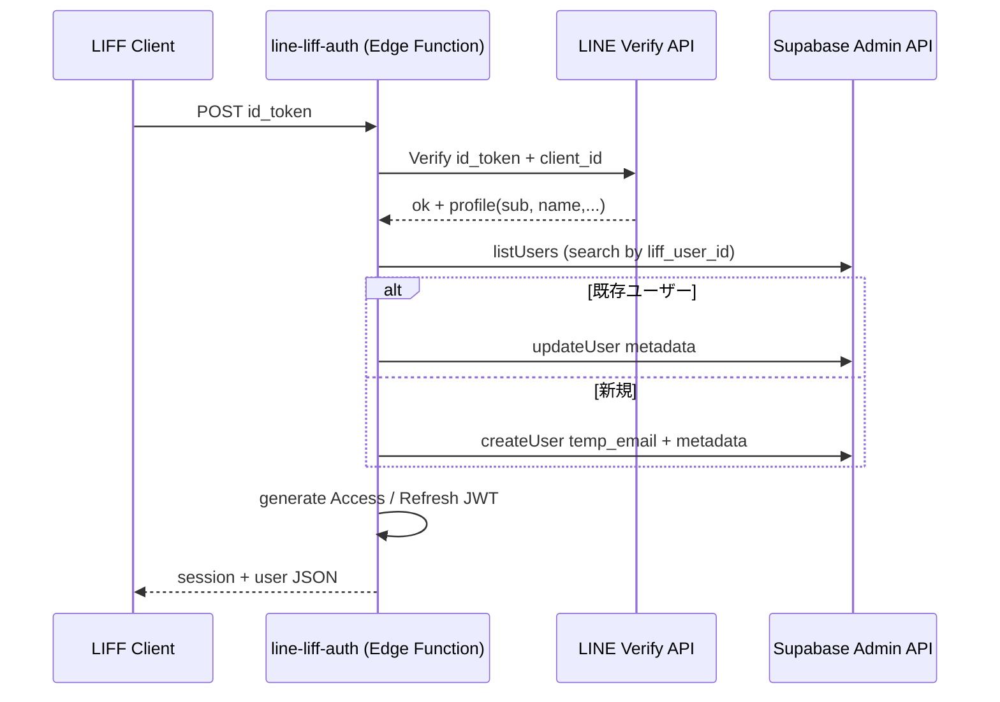

# 📄 verify-line Edge Function 仕様書

> **目的**: LINE Login (LIFF) の `id_token` を検証し、Supabase Auth ユーザーを自動作成・更新した後に **JWT(Access / Refresh)** を発行するサーバーレス関数です。モバイル Web (LIFF) からのシングルサインオンを安全かつ高速に実現します。

このドキュメント単体を Cursor に貼り付ければ、Edge Function の実装・テスト・デプロイ・運用まで **再現可能** となることを目指します。

---

## 🗂️ ファイル構成 (提案)
```
supabase/functions/
  └─ line-liff-auth/        # ← [3] 新フォルダ名の提案 (詳細は末尾参照)
       ├─ index.ts          # 関数本体
       ├─ flexTemplates.ts  # LINE Flex Message など (任意)
       ├─ quickActions.ts   # 同上 (任意)
       └─ README.md         # ← 本ファイル
```

---

## 1. 環境変数
| 変数 | 説明 | 例 |
|---|---|---|
| `LINE_CHANNEL_ID` | LINE Login Channel ID | `1234567890` |
| `EDGE_FUNCTION_JWT` | JWT 署名用の **十分に長いランダム文字列** | `super-secret-key` |
| `SUPABASE_URL` | Supabase プロジェクト URL | `https://xyz.supabase.co` |
| `SUPABASE_SERVICE_ROLE_KEY` | Supabase Service Role Key | `eyJhbGciOi...` |

> Supabase Dashboard → **Project Settings → API** で入手できます。

---

## 2. エンドポイント仕様
| 項目 | 値 |
|---|---|
| HTTP Method | `POST` (CORS: `OPTIONS` 対応) |
| URL | `https://<project-ref>.supabase.co/functions/v1/verify-line` |
| 認証 | なし (id_token により本人確認) |
| リクエストヘッダ | `Content-Type: application/json` |
| リクエストボディ | `{ "id_token": "<LINE id_token>" }` |

### 2.1 リクエスト例
```bash
curl -X POST \
  -H "Content-Type: application/json" \
  -d '{"id_token":"<LINE id_token>"}' \
  https://<project-ref>.supabase.co/functions/v1/verify-line
```

### 2.2 成功レスポンス (200)
```json
{
  "session": {
    "access_token": "<JWT>",
    "refresh_token": "<JWT>",
    "expires_in": 86400,
    "expires_at": 1700000000
  },
  "user": {
    "id": "uuid",
    "email": "<sub>@line.user",
    "user_metadata": {
      "liff_user_id": "<sub>",
      "liff_display_name": "Line Name",
      "liff_picture_url": "https://...",
      "provider": "line"
    }
  }
}
```

### 2.3 エラーレスポンス例
| HTTP status | body.sample | 説明 |
|---|---|---|
| 400 | `{ "error": "ID token is required" }` | id_token 未指定 |
| 401 | `{ "error": "LINE API error: invalid token" }` | id_token 検証失敗 |
| 500 | `{ "error": "Missing required environment variables: ..." }` | 環境設定不備／内部例外 |

---

## 3. 処理フロー


---

## 4. JWT 仕様
| トークン | exp | claims 主要部 | 備考 |
|---|---|---|---|
| Access Token | 24h | `sub` (uuid), `aud=authenticated`, `role=authenticated`, `email`, `user_metadata` | `HS256` 署名 |
| Refresh Token | 30d | `sub`, `type=refresh` | `HS256` 署名 |

JWT の `secret` には環境変数 `EDGE_FUNCTION_JWT` を用います。Supabase Auth が発行する JWT と分離し、**Cookie ではなくクライアント保管**を想定しています。

---

## 5. Supabase User ポリシー
1. **検索キー**: `user_metadata.liff_user_id === LINE sub`
2. ユーザーが存在しない場合
   - メールアドレス: `<sub>@line.user` (ユニーク保証)
   - `email_confirm=true` でメール確認をスキップ
3. 既存ユーザーの場合
   - display_name, picture_url を毎回更新して最新に保つ
4. `app_metadata.providers = ['line']` を付与し、他プロバイダとの識別を可能に

---

## 6. ローカル開発 & テスト
```bash
# 1. Supabase ローカル起動
supabase start

# 2. Edge Function 実行 (watch mode)
supabase functions serve line-liff-auth --no-verify-jwt --env-file ./local.env

# 3. Unit Test (Deno)
#   - test.ts 内にテストケースを追加
supabase functions test line-liff-auth
```

> ローカル環境では `--no-verify-jwt` を付けることで Supabase 側の JWT 検証をスキップできます。

---

## 7. デプロイ手順
```bash
# ログイン
supabase login --token <access-token>

# プロジェクト選択
supabase link --project-ref <project-ref>

# Edge Function デプロイ
supabase functions deploy line-liff-auth --no-verify-jwt
```
デプロイ後、Supabase Edge Functions の URL が自動付与されます。

---

## 8. セキュリティ考慮
- `id_token` は 30 分以内に失効する短命トークンのため、リプレイ攻撃は限定的
- `EDGE_FUNCTION_JWT` は 256bit 以上を推奨し、DashBoard 上で **Protected** に設定
- CORS: Origin をリクエストヘッダの値で Echo する動的実装。必要に応じホワイトリスト化
- Supabase Service Role Key は **Edge Function 内限定** で使用 (DB 直接 expose しない)

---

## 9. 参考リンク
- Supabase Edge Functions: https://supabase.com/docs/guides/functions
- LINE Login: https://developers.line.biz/ja/docs/line-login/
- jose (JWT): https://deno.land/x/jose

---

## 🔖 新フォルダ名の提案 ([3])
- **`line-liff-auth`** : 「LINE + LIFF + Auth」を簡潔に表現
- その他候補: `line-login-auth`, `liff-verify`, `line-oauth`

> 本 README では `line-liff-auth` を例として使用しています。既存の `verify-line` ディレクトリをリネームするか、新規作成してファイルを移動してください。

---

### 🎉 これで準備完了
この README を Cursor に読み込ませるだけで、実装・環境構築・テスト・デプロイまで一通り再現できます。 